# Arquitectura del Sistema - ETERNA DX Rules Engine

## Visión de Alto Nivel

El sistema ETERNA DX Rules Engine implementa una arquitectura de 3 capas con separación clara de responsabilidades:

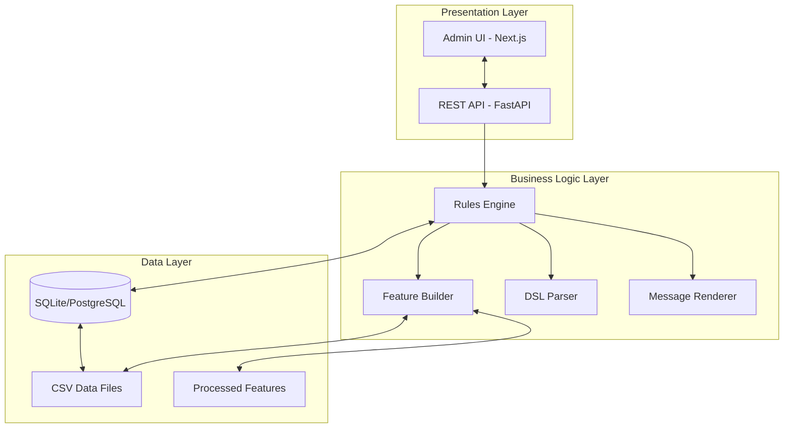

## Componentes Principales

### 1. Admin UI (Next.js Frontend)

**Responsabilidades:**
- Interfaz de usuario para gestión de reglas
- Visualización de estadísticas y analytics
- Testing y simulación de reglas
- Import/export de configuraciones

**Tecnologías:**
- Next.js 14 con App Router
- React 18 con TypeScript
- TailwindCSS para estilos
- Axios para comunicación HTTP

**Estructura de páginas:**
```
admin-ui/app/
├── rules/              # CRUD de reglas
│   ├── page.tsx       # Lista de reglas
│   ├── new/page.tsx   # Crear regla
│   └── [id]/page.tsx  # Editar regla
├── stats/page.tsx     # Dashboard de estadísticas
├── logs/page.tsx      # Auditoría y logs
└── simulate/page.tsx  # Testing de reglas
```

### 2. FastAPI Backend

**Responsabilidades:**
- API REST para todas las operaciones
- Validación de datos con Pydantic
- Autenticación y autorización
- Orquestación del motor de reglas

**Endpoints principales:**
```
/rules          # CRUD de reglas
/simulate       # Evaluación de reglas
/analytics      # Estadísticas y logs
/variables      # Metadatos de variables
/health         # Health checks
```

**Middleware y configuración:**
- CORS para desarrollo local
- Validación automática con Pydantic
- Manejo centralizado de errores
- Logging estructurado

### 3. Rules Engine (Core Business Logic)

**Responsabilidades:**
- Evaluación de condiciones DSL
- Selección ponderada de mensajes
- Anti-repetición inteligente
- Aplicación de cooldowns y límites

**Componentes clave:**
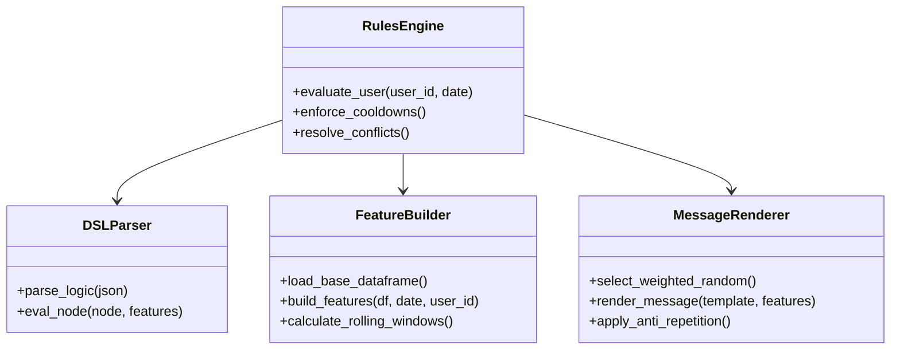

### 4. Data Processing Pipeline

**Responsabilidades:**
- ETL de datos CSV raw
- Cálculo de métricas derivadas
- Generación de features para ML

**Flujo de procesamiento:**
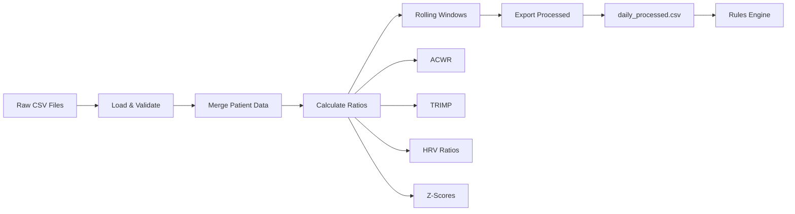

## Patrones de Diseño Implementados

### 1. Strategy Pattern - Evaluación DSL
```python
# Diferentes estrategias de evaluación según tipo de nodo
def eval_node(node, features, why):
    if isinstance(node, NumericLeaf):
        return eval_numeric_leaf(node, features, why)
    elif isinstance(node, RelativeLeaf):
        return eval_relative_leaf(node, features, why)
    elif isinstance(node, GroupAll):
        return all(eval_node(child, features, why) for child in node.all)
    # ... más estrategias
```

### 2. Template Method - Pipeline de evaluación
```python
def evaluate_user(user_id, target_day):
    # 1. Preparación (template method)
    df = load_base_dataframe()
    features = build_features(df, target_day, user_id)
    rules = get_enabled_rules()
    
    # 2. Evaluación (variable por regla)
    for rule in rules:
        fired = eval_node(rule.logic, features)
        # ...
    
    # 3. Post-procesamiento (template method)
    events = enforce_cooldowns(events)
    events = resolve_conflicts(events)
    return events
```

### 3. Observer Pattern - Auditoría
```python
# Cada evaluación genera un audit log automáticamente
def evaluate_user(...):
    for rule in rules:
        fired = eval_node(rule.logic, features)
        # Observer: siempre registra el evento
        audit = Audit(
            user_id=user_id,
            rule_id=rule.id, 
            fired=fired,
            why=why,
            values=features
        )
        session.add(audit)
```

### 4. Factory Pattern - Creación de nodos DSL
```python
class RuleModel(BaseModel):
    def __post_init__(self):
        # Factory para crear nodos según estructura JSON
        self.logic = self._parse_logic_node(self.logic)
    
    def _parse_logic_node(self, data):
        if "all" in data:
            return GroupAll(all=[self._parse_logic_node(child) for child in data["all"]])
        elif "var" in data:
            return NumericLeaf(var=data["var"], op=data["op"], value=data["value"])
        # ... más tipos
```

## Flujos de Datos Críticos

### 1. Evaluación de Recomendaciones

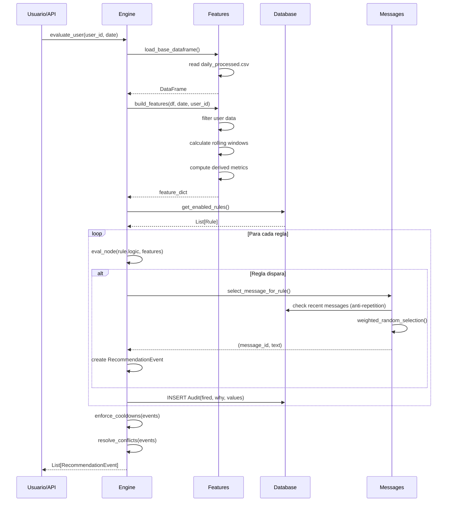

### 2. Procesamiento de Datos (ETL)

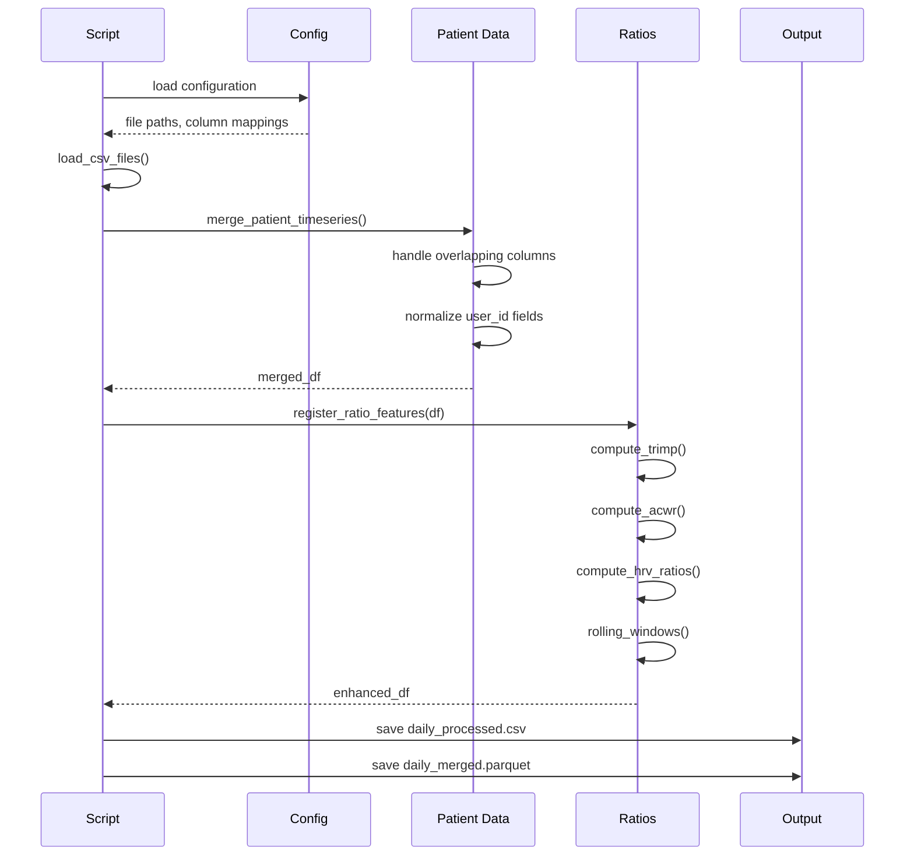

### 3. Import/Export de Reglas

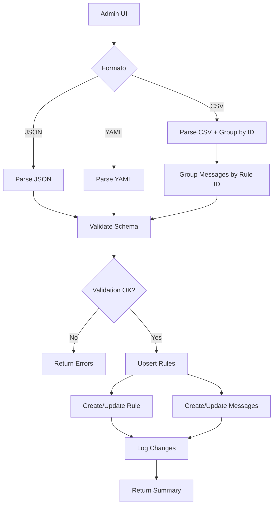

## Modelo de Datos Detallado

### Core Entities

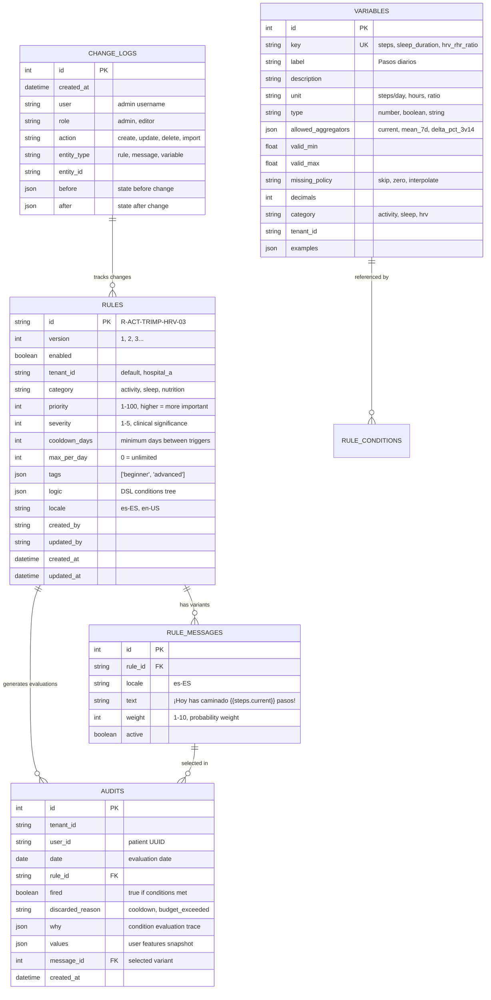

### Feature Data Model

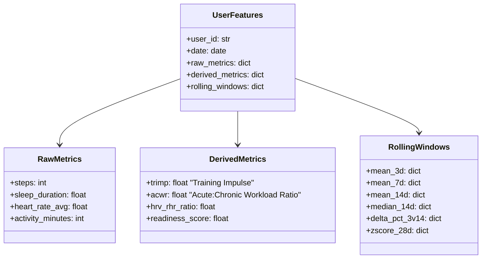

## DSL (Domain Specific Language)

### Sintaxis y Gramática

El DSL permite definir condiciones de reglas en JSON estructurado:

```json
{
  "all": [
    {
      "var": "steps",
      "agg": "current", 
      "op": "<",
      "value": 5000,
      "required": true
    },
    {
      "any": [
        {
          "var": "sleep_duration",
          "agg": "current",
          "op": "<", 
          "value": 6.5
        },
        {
          "left": {"var": "hrv_rhr_ratio", "agg": "delta_pct_3v14"},
          "op": "<",
          "right": {"var": "hrv_rhr_ratio", "agg": "mean_28d", "scale": 0.8}
        }
      ]
    }
  ]
}
```

### Tipos de Nodos

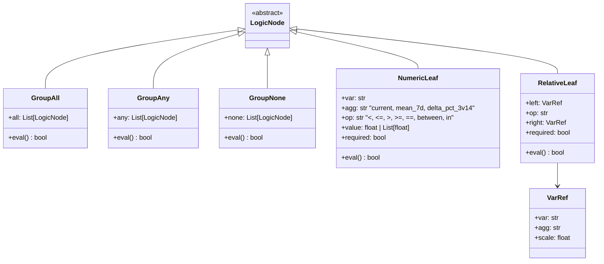

### Operadores Soportados

| Operador | Descripción | Ejemplo |
|----------|-------------|---------|
| `<` | Menor que | `steps < 5000` |
| `<=` | Menor o igual | `sleep_duration <= 6.5` |
| `>` | Mayor que | `trimp > 100` |
| `>=` | Mayor o igual | `hrv_ratio >= 1.2` |
| `==` | Igual | `activity_level == 'high'` |
| `between` | Entre rango | `heart_rate between [60, 100]` |
| `in` | En conjunto | `day_of_week in ['monday', 'tuesday']` |

### Agregadores Disponibles

| Agregador | Descripción | Ventana |
|-----------|-------------|---------|
| `current` | Valor del día actual | 1 día |
| `mean_3d` | Media de 3 días | 3 días |
| `mean_7d` | Media de 7 días | 7 días |
| `mean_14d` | Media de 14 días | 14 días |
| `mean_28d` | Media de 28 días | 28 días |
| `median_14d` | Mediana de 14 días | 14 días |
| `delta_pct_3v14` | Cambio % de media 3d vs 14d | 3d vs 14d |
| `zscore_28d` | Z-score en ventana de 28 días | 28 días |

## Seguridad y Autorización

### Modelo de Roles

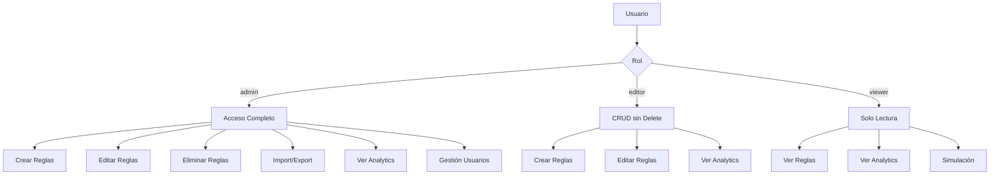

### Autenticación (TODO)

```python
# Implementación futura con JWT
from fastapi_users import FastAPIUsers
from fastapi_users.authentication import JWTAuthentication

# Current placeholder
def _current_user() -> dict[str, Any]:
    if not settings.auth_enabled:
        return {"user": "anonymous", "role": "admin"}
    # TODO: Implementar JWT/OAuth2
    return {"user": "unknown", "role": "viewer"}
```

### Auditoría y Trazabilidad

Todas las operaciones de escritura generan logs en `ChangeLog`:

```python
def _log_change(session, ctx, action, entity_type, entity_id, before, after):
    session.add(ChangeLog(
        user=ctx.get("user"),
        role=ctx.get("role"), 
        action=action,          # create, update, delete, import
        entity_type=entity_type, # rule, message, variable
        entity_id=entity_id,
        before=before,          # estado anterior
        after=after             # estado nuevo
    ))
```

## Performance y Escalabilidad

### Métricas de Performance Actual

| Operación | Tiempo Promedio | Complejidad |
|-----------|-----------------|-------------|
| `evaluate_user()` | ~200ms | O(R×C) |
| `build_features()` | ~100ms | O(N×W) |
| `load_base_dataframe()` | ~500ms | O(N) |
| API `/simulate` | ~800ms | O(R×C+N×W) |
| Admin UI página reglas | ~300ms | O(R) |

Donde:
- R = número de reglas activas (~50-200)
- C = condiciones promedio por regla (~3-5)
- N = días de datos por usuario (~365-1000)
- W = ventana máxima de rolling (~28 días)

### Cuellos de Botella Identificados

1. **CSV Loading**: `pandas.read_csv()` en cada evaluación
2. **Feature Calculation**: Rolling windows recalculadas cada vez
3. **Database Queries**: N+1 queries en evaluación de reglas
4. **Memory Usage**: DataFrames completos en memoria

### Estrategias de Optimización

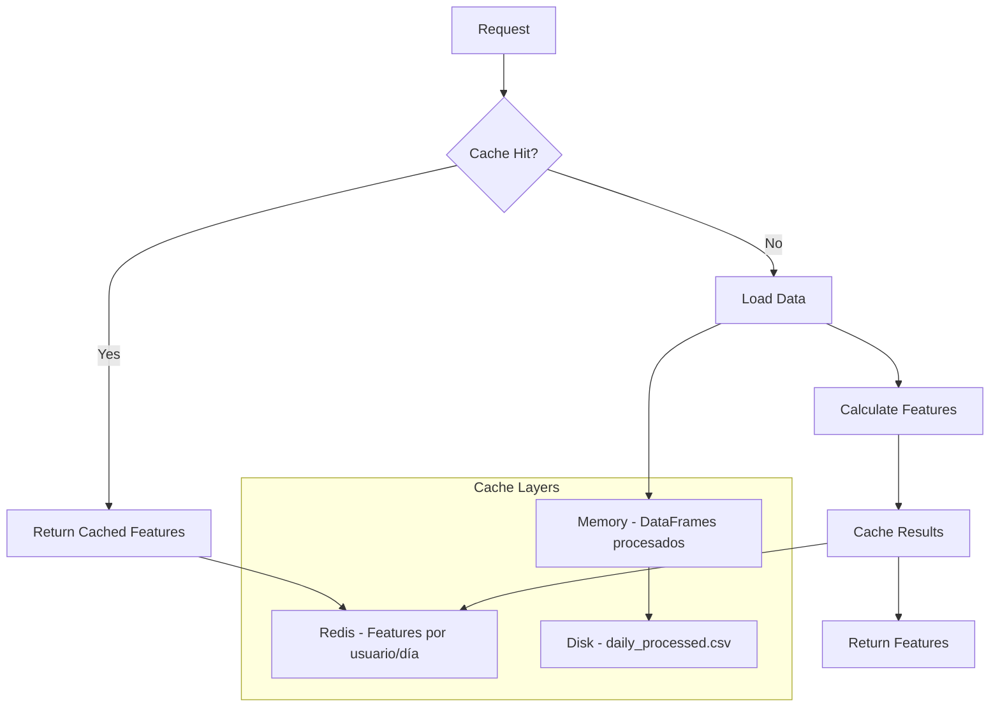

### Límites de Escalabilidad

| Métrica | Límite Actual | Límite Objetivo |
|---------|---------------|-----------------|
| Usuarios concurrentes | ~10 | ~1000 |
| Reglas activas | ~200 | ~2000 |
| Evaluaciones/minuto | ~100 | ~10000 |
| Tamaño base datos | ~100MB | ~10GB |
| Datos CSV | ~50MB | ~1GB |

## Deployment y DevOps

### Arquitectura de Despliegue

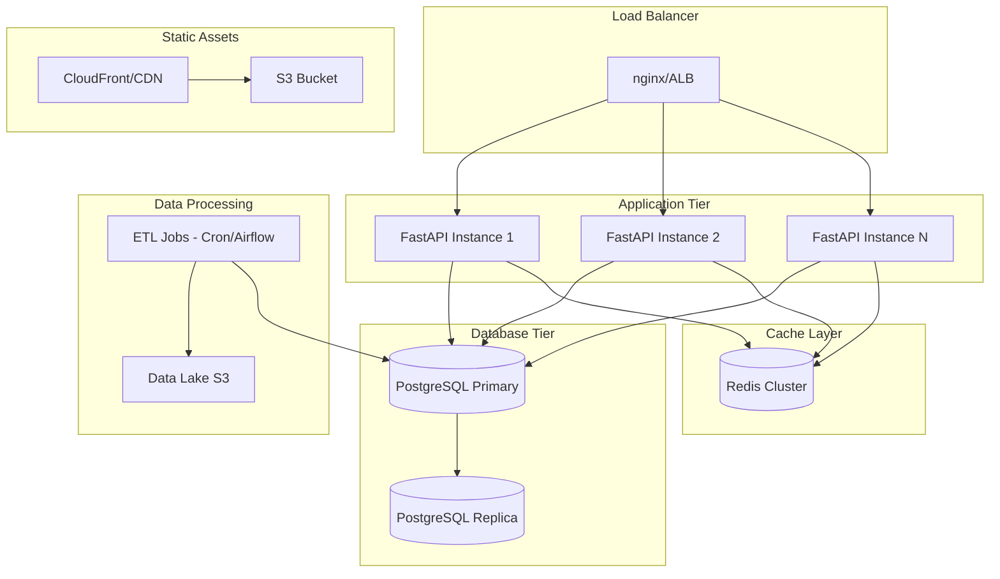

### Docker Configuration

```dockerfile
# Multi-stage build para optimizar tamaño
FROM node:18-alpine AS frontend-build
WORKDIR /app/admin-ui
COPY admin-ui/package*.json ./
RUN npm ci --only=production
COPY admin-ui/ ./
RUN npm run build

FROM python:3.11-slim AS backend
WORKDIR /app

# Install system dependencies
RUN apt-get update && apt-get install -y \
    gcc \
    && rm -rf /var/lib/apt/lists/*

# Python dependencies
COPY requirements.txt ./
RUN pip install --no-cache-dir -r requirements.txt

# Application code
COPY backend/ ./backend/
COPY src/ ./src/
COPY scripts/ ./scripts/
COPY config.py ./

# Static files from frontend build
COPY --from=frontend-build /app/admin-ui/out ./static/

# Health check
HEALTHCHECK --interval=30s --timeout=10s --start-period=5s --retries=3 \
    CMD curl -f http://localhost:8000/health || exit 1

EXPOSE 8000
CMD ["uvicorn", "backend.app:app", "--host", "0.0.0.0", "--port", "8000"]
```

### Kubernetes Manifests

```yaml
# deployment.yaml
apiVersion: apps/v1
kind: Deployment
metadata:
  name: eterna-rules-engine
spec:
  replicas: 3
  selector:
    matchLabels:
      app: eterna-rules-engine
  template:
    metadata:
      labels:
        app: eterna-rules-engine
    spec:
      containers:
      - name: api
        image: eterna/rules-engine:latest
        ports:
        - containerPort: 8000
        env:
        - name: DATABASE_URL
          valueFrom:
            secretKeyRef:
              name: db-secret
              key: url
        - name: REDIS_URL
          value: "redis://redis-service:6379"
        resources:
          requests:
            memory: "256Mi"
            cpu: "250m"
          limits:
            memory: "512Mi" 
            cpu: "500m"
        livenessProbe:
          httpGet:
            path: /health
            port: 8000
          initialDelaySeconds: 30
          periodSeconds: 10
        readinessProbe:
          httpGet:
            path: /health
            port: 8000
          initialDelaySeconds: 5
          periodSeconds: 5
---
apiVersion: v1
kind: Service
metadata:
  name: eterna-rules-service
spec:
  selector:
    app: eterna-rules-engine
  ports:
  - port: 80
    targetPort: 8000
  type: LoadBalancer
```

### Monitoring y Observabilidad

```python
# metrics.py - Prometheus metrics
from prometheus_client import Counter, Histogram, Gauge

# Métricas de negocio
RULES_EVALUATED = Counter('rules_evaluated_total', 'Total rules evaluated', ['tenant_id'])
RECOMMENDATIONS_GENERATED = Counter('recommendations_generated_total', 'Total recommendations generated', ['category'])
EVALUATION_DURATION = Histogram('evaluation_duration_seconds', 'Time spent evaluating rules')
ACTIVE_RULES = Gauge('active_rules_count', 'Number of active rules', ['tenant_id'])

# Métricas técnicas  
HTTP_REQUESTS = Counter('http_requests_total', 'Total HTTP requests', ['method', 'endpoint', 'status'])
DATABASE_QUERIES = Histogram('database_query_duration_seconds', 'Database query duration')
CACHE_HITS = Counter('cache_hits_total', 'Cache hits', ['cache_type'])
```

### Logging Strategy

```python
# logging_config.py
import structlog

# Configuración de logging estructurado
structlog.configure(
    processors=[
        structlog.stdlib.filter_by_level,
        structlog.stdlib.add_logger_name,
        structlog.stdlib.add_log_level,
        structlog.stdlib.PositionalArgumentsFormatter(),
        structlog.processors.TimeStamper(fmt="iso"),
        structlog.processors.StackInfoRenderer(),
        structlog.processors.format_exc_info,
        structlog.processors.UnicodeDecoder(),
        structlog.processors.JSONRenderer()
    ],
    context_class=dict,
    logger_factory=structlog.stdlib.LoggerFactory(),
    wrapper_class=structlog.stdlib.BoundLogger,
    cache_logger_on_first_use=True,
)

# Uso en código
logger = structlog.get_logger()
logger.info("rule_evaluated", 
           user_id=user_id, 
           rule_id=rule.id, 
           fired=fired, 
           duration_ms=duration)
```

## Roadmap Técnico

### Q1 2025 - Estabilización
- ✅ Implementar autenticación JWT/OAuth2
- ✅ Cache Redis para features
- ✅ Métricas Prometheus
- ✅ CI/CD pipeline
- ✅ Tests de integración

### Q2 2025 - Performance  
- 🔄 Async endpoints
- 🔄 Database connection pooling
- 🔄 GraphQL API alternativa
- 🔄 Batch evaluation endpoints
- 🔄 Real-time notifications

### Q3 2025 - Escalabilidad
- ⏳ Microservicios (Rules Engine separado)
- ⏳ Event sourcing para auditoría
- ⏳ ML-based rule recommendations
- ⏳ Multi-tenant isolation
- ⏳ Data partitioning

### Q4 2025 - Intelligence
- ⏳ A/B testing de reglas
- ⏳ Adaptive thresholds
- ⏳ Predictive recommendations
- ⏳ Natural language rule creation
- ⏳ Advanced analytics dashboard
